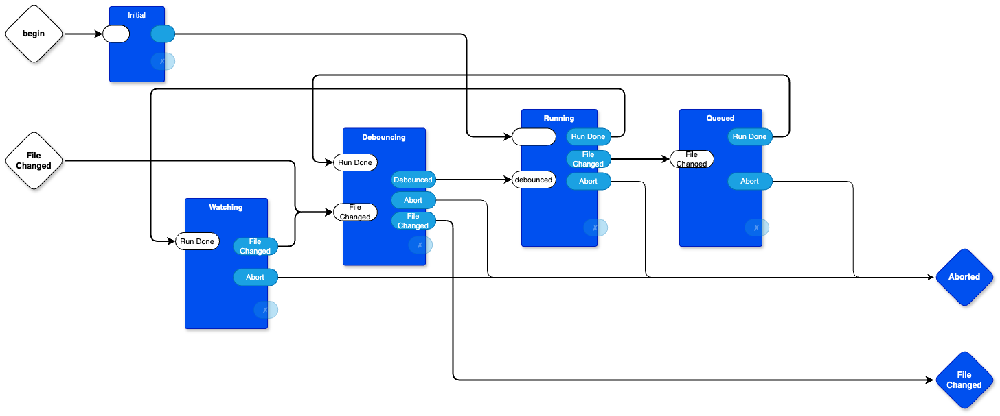

# quickie redrawing of diagram in https://github.com/google/wireit/blob/main/src/watcher.ts
- The point is to show how to draw a compilable diagram. (I'm sure that this quickie example diagram is incorrect in some manner).
- (-) use draw.io (https://app.diagrams.net)
- (a) make each box stand-alone (use processes, or closures, or 0D)
- (b) put input and output ports on each box
- (c) join the boxes with arrows
- (d) compile with `das2json` tool
  - (d') examine the `.json`, if you wish
- (e) run the compiled diagram with 0D (omitted in this quickie example) (https://github.com/guitarvydas/0D)




```
[
    {
        "file": "watcher.drawio",
        "name": "watcher",
        "children": [
            {
                "name": "Running",
                "id": 7
            },
            {
                "name": "Initial",
                "id": 14
            },
            {
                "name": "Queued",
                "id": 15
            },
            {
                "name": "Debouncing",
                "id": 20
            },
            {
                "name": "Watching",
                "id": 27
            }
        ],
        "connections": [
            {
                "dir": 0,
                "source": {
                    "name": "",
                    "id": 0
                },
                "source_port": "begin",
                "target": {
                    "name": "Initial",
                    "id": 14
                },
                "target_port": ""
            },
            {
                "dir": 0,
                "source": {
                    "name": "",
                    "id": 0
                },
                "source_port": "File<div>Changed</div>",
                "target": {
                    "name": "Debouncing",
                    "id": 20
                },
                "target_port": "File Changed"
            },
            {
                "dir": 1,
                "source": {
                    "name": "Watching",
                    "id": 27
                },
                "source_port": "File Changed",
                "target": {
                    "name": "Debouncing",
                    "id": 20
                },
                "target_port": "File Changed"
            },
            {
                "dir": 1,
                "source": {
                    "name": "Debouncing",
                    "id": 20
                },
                "source_port": "Debounced",
                "target": {
                    "name": "Running",
                    "id": 7
                },
                "target_port": "debounced"
            },
            {
                "dir": 1,
                "source": {
                    "name": "Running",
                    "id": 7
                },
                "source_port": "Run Done",
                "target": {
                    "name": "Watching",
                    "id": 27
                },
                "target_port": "Run Done"
            },
            {
                "dir": 1,
                "source": {
                    "name": "Running",
                    "id": 7
                },
                "source_port": "File Changed",
                "target": {
                    "name": "Queued",
                    "id": 15
                },
                "target_port": "File Changed"
            },
            {
                "dir": 1,
                "source": {
                    "name": "Initial",
                    "id": 14
                },
                "source_port": "",
                "target": {
                    "name": "Running",
                    "id": 7
                },
                "target_port": ""
            },
            {
                "dir": 1,
                "source": {
                    "name": "Queued",
                    "id": 15
                },
                "source_port": "Run Done",
                "target": {
                    "name": "Debouncing",
                    "id": 20
                },
                "target_port": "Run Done"
            },
            {
                "dir": 2,
                "source": {
                    "name": "Queued",
                    "id": 15
                },
                "source_port": "Abort",
                "target": {
                    "name": "",
                    "id": 0
                },
                "target_port": "Aborted"
            },
            {
                "dir": 2,
                "source": {
                    "name": "Debouncing",
                    "id": 20
                },
                "source_port": "File Changed",
                "target": {
                    "name": "",
                    "id": 0
                },
                "target_port": "File<div>Changed</div>"
            },
            {
                "dir": 2,
                "source": {
                    "name": "Running",
                    "id": 7
                },
                "source_port": "Abort",
                "target": {
                    "name": "",
                    "id": 0
                },
                "target_port": "Aborted"
            },
            {
                "dir": 2,
                "source": {
                    "name": "Debouncing",
                    "id": 20
                },
                "source_port": "Abort",
                "target": {
                    "name": "",
                    "id": 0
                },
                "target_port": "Aborted"
            },
            {
                "dir": 2,
                "source": {
                    "name": "Watching",
                    "id": 27
                },
                "source_port": "Abort",
                "target": {
                    "name": "",
                    "id": 0
                },
                "target_port": "Aborted"
            }
        ]
    }
]```
